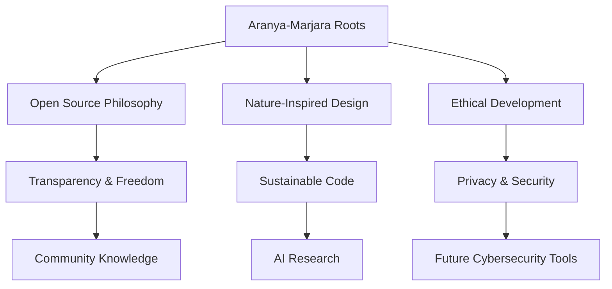

  

# 🐾 Aranya-Marjara

### *Where Code Meets the Wilderness*

**"Building ethical open-source ecosystems with the grace of a Wild Cat and the wisdom of the ancient woods."**

---

## 🌳 About the Organization

**Aranya-Marjara** (Sanskrit: *Wild Cat*) is a **open-source organization** —  
currently maintained by a single **self-taught developer** — exploring how technology can be  
as **ethical, adaptive, and harmonious** as nature itself.

This organization focuses on creating transparent, research-driven software,  
mainly in the fields of **Artificial Intelligence** and, in the future, **Cybersecurity**.  
Every project here is built with respect for **freedom, privacy, learning** and the projects are intended purely for **educational** or **research purposes**, not for **commercial use** or **competition**.
---

## 🏹 Our Core Beliefs

- **Ethical by Design** — open, transparent, and non-commercial  
- **Silent Execution** — code that works beautifully without noise  
- **Adaptive Architecture** — systems that evolve like living organisms  
- **Knowledge as a Forest** — shared freely to grow and thrive  
- **Security as Respect** — we follow best-effort security practices to protect user data and privacy.
---

## 🛠️ Our Forest Ecosystem

### 🌟 **Current Projects**

| Project | Status | Description |
|----------|---------|-------------|
| [ScoutAgent](https://github.com/Aranya-Marjara/ScoutAgent) | 🟢 Active | Autonomous research and news intelligence agent |
| [mini-transformer-lab](https://github.com/Aranya-Marjara/mini-transformer-lab) | 🟢 Active | Compact transformer model built from scratch to study LLMs |
| [VanaSight](https://github.com/Aranya-Marjara/vanasight) | 🟢 Active | Complete computer vision pipeline — *From Pixels to Perception* |
*(Cybersecurity projects will sprout soon...)*

---

### 🎯 **Current Hunting Party**

At present, the forest is tended by a **solo wanderer** —  
each “party” below represents a focus area of ongoing or future exploration.

- 🦁 **Backend Beasts** — AI logic, model training, and architecture *(active)*  
- 🐾 **Frontend Forest** — interfaces and visualization *(planned)*  
- ⚙️ **DevOps Den** — lightweight automation and deployment *(maintained)*  
- 🦉 **Wildlife Watch** — documentation, learning, and outreach *(ongoing)*  
- 🛡️ **Cyber Canopy** — security tools and ethical hacking *(future path)*  

---

## 📜 The Digital Canopy

## ⚠️ Disclaimer

All projects are experimental and research-focused. Code is provided as-is. No formal security audits have been conducted. Users should evaluate tools before using them in production.

